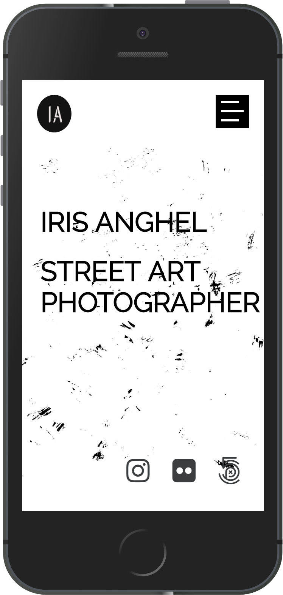
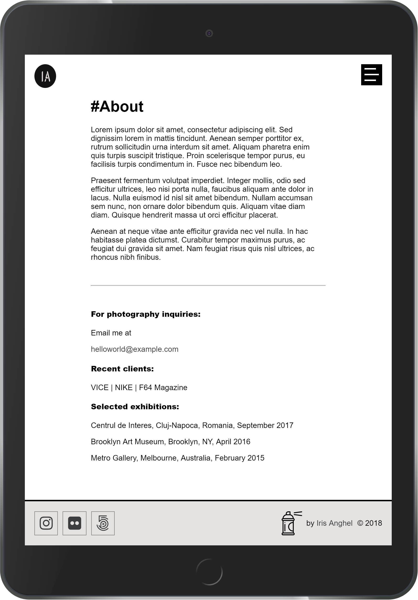
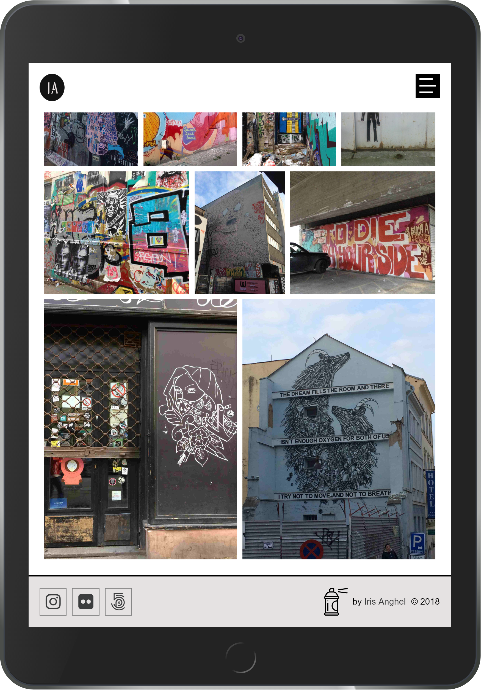

# Street art photographer website

This is a mockup responsive website for a street art photographer.
It includes a homepage, an about page and a portfolio.

## Dependencies

* [jQuery](https://jquery.com/)
* [Lightbox](https://lokeshdhakar.com/projects/lightbox2/)

## Sources 
* [Homepage texture - Grunge and Grit Textures by Zach Terrell](https://creativemarket.com/zachterrell/1691073-Grunge-and-Grit-Textures)
* [Spray can icon](https://www.flaticon.com/)

